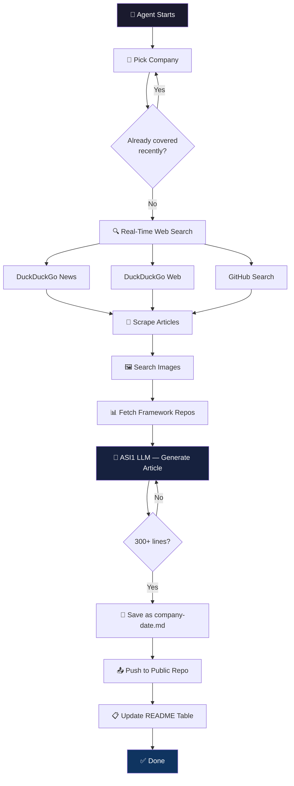
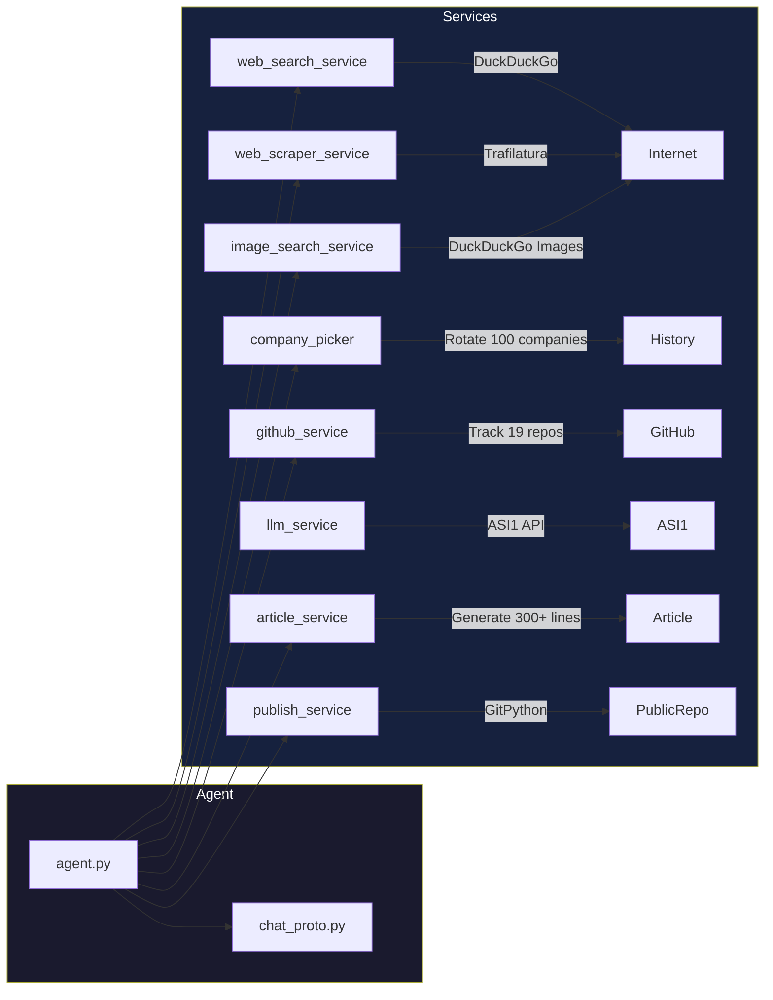

# AI Tech Daily Agent

A **uAgent** (Fetch.ai) that writes daily deep-dive articles about AI/tech companies with real-time web research.

Each day it **auto-picks a company**, does **real-time web search**, scrapes articles, finds images, and writes a **300+ line deep-dive**.

## Live Output

**[github.com/gautammanak1/ai-tech-daily](https://github.com/gautammanak1/ai-tech-daily)**

---

## Workflow



---

## Architecture



---

## Quick Start

```bash
git clone https://github.com/gautammanak1/ai-tech-daily-agent.git
cd ai-tech-daily-agent

cp .env.example .env
# Add your ASI_ONE_API_KEY and GH_TOKEN

pip install uv && uv sync

# Chat agent mode
uv run python agent.py

# CLI mode (one-shot)
uv run python agent.py --cli
```

---

## 100 Companies (auto-rotates daily)

### Big Tech
Google, Microsoft, Apple, Amazon, Meta, NVIDIA, Tesla, Samsung, Intel, AMD, Qualcomm, IBM, Oracle, Salesforce, Adobe

### Frontier AI Labs
OpenAI, Anthropic, xAI, Mistral AI, Cohere, AI21 Labs, Inflection AI, Stability AI, Aleph Alpha, DeepSeek, Zhipu AI, Minimax

### AI Agent Frameworks
Fetch.ai, LangChain, CrewAI, Composio, Daytona, AutoGPT, Pydantic AI, Agno, Semantic Kernel, Haystack, LlamaIndex, Dify, Flowise, Rivet, SuperAGI, BabyAGI, Camel AI

### AI Infrastructure
Hugging Face, Databricks, Snowflake, Weights & Biases, Scale AI, Anyscale, Modal, Replicate, Together AI, Groq, Cerebras, CoreWeave, Lambda

### AI Coding Tools
Cursor, Replit, GitHub Copilot, Codeium, Tabnine, Sourcegraph, Vercel, Supabase

### AI Search & Knowledge
Perplexity, You.com, Brave Search, Tavily, Exa

### AI Image & Video
Midjourney, Runway, Pika, ElevenLabs, Luma AI, Leonardo AI

### Robotics & Autonomous
Boston Dynamics, Figure AI, Waymo, Cruise, 1X Technologies

### Web3 & Crypto AI
Ocean Protocol, SingularityNET, Bittensor, Render Network, Chainlink

### AI Security & Safety
Anthropic Safety, OpenAI Safety, Lakera, Protect AI

### AI Data & Vector
Pinecone, Weaviate, Qdrant, Chroma, Milvus

### Protocols
MCP Ecosystem, Google A2A

### Emerging Startups
Glean, Jasper AI, Writer, Adept AI, Harvey AI, Cognition (Devin)

---

## GitHub Actions

Add secrets: `ASI_ONE_API_KEY`, `GH_PAT` (classic, `repo` scope).

Runs daily at 6:00 AM UTC.

---

## Tech Stack

| Component | Technology |
|-----------|-----------|
| Agent Framework | uAgents (Fetch.ai) + Chat Protocol |
| Web Search | DuckDuckGo (ddgs) — no API key needed |
| Article Scraping | Trafilatura |
| Image Search | DuckDuckGo Images |
| LLM | ASI1 API (asi1-mini) |
| Git | GitPython |
| CI/CD | GitHub Actions |
| Language | Python 3.11 + uv |
