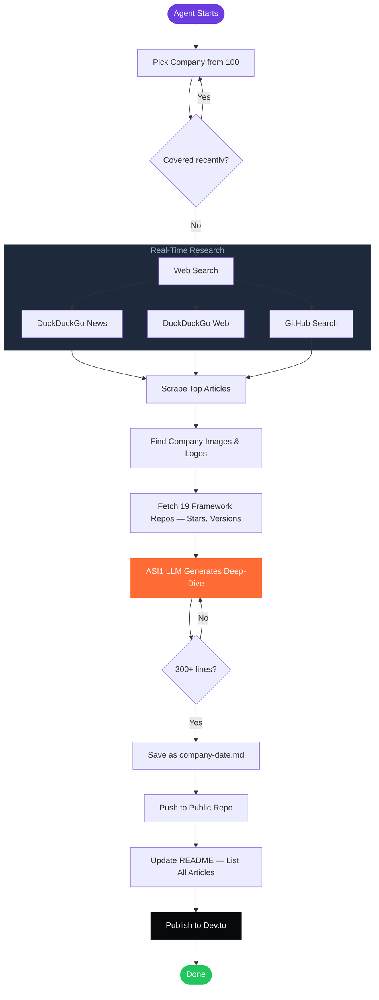
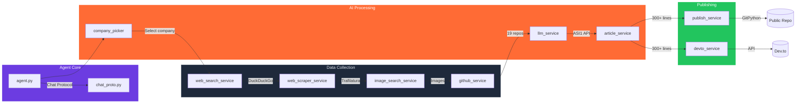

<div align="center">


# AI Tech Daily Agent

**An autonomous AI agent that researches and writes 800+ line deep-dive articles about tech companies — every single day.**

[Live Articles](https://github.com/gautammanak1/ai-tech-daily) · [Report Bug](https://github.com/gautammanak1/ai-tech-daily-agent/issues) · [Request Company](https://github.com/gautammanak1/ai-tech-daily-agent/issues)

</div>

---

## What Is This?

An AI agent built with **Fetch.ai uAgents** that runs autonomously every day:

1. **Picks** a company from a pool of 100 (auto-rotates, never repeats recently)
2. **Searches** the web in real-time — news, articles, GitHub repos
3. **Scrapes** top sources for raw content
4. **Finds** company logos and tech images
5. **Writes** a 300-800+ line deep-dive article with code snippets, stats, and source links
6. **Publishes** to a public GitHub repo — each article as a separate file, old articles never deleted
7. **Cross-posts** to [Dev.to](https://dev.to) automatically via their API

> No templates. No cached data. Every article is researched and written from scratch using live web data.

---

## Live Output

[](https://github.com/gautammanak1/ai-tech-daily)
[](https://dev.to/gautammanak1)

---

## How It Works



---

## Architecture



---

## Project Structure

```
ai-tech-daily-agent/
├── agent.py                        # uAgent entry point — chat mode or CLI
├── protocols/
│   └── chat_proto.py               # Fetch.ai chat protocol handler
├── services/
│   ├── company_picker.py           # Auto-rotate 100 companies
│   ├── web_search_service.py       # Real-time DuckDuckGo search
│   ├── web_scraper_service.py      # Trafilatura article scraping
│   ├── image_search_service.py     # Logo + tech image search
│   ├── github_service.py           # Track 19 framework repos
│   ├── llm_service.py              # ASI1 LLM calls
│   ├── article_service.py          # Deep-dive article generation
│   ├── publish_service.py          # Git push to public repo
│   └── devto_service.py            # Auto-publish to Dev.to
├── config/
│   └── sources.py                  # Tracked framework repos list
├── .github/workflows/
│   └── daily.yml                   # GitHub Actions — runs daily at 6 AM UTC
├── pyproject.toml                  # Dependencies (uv)
└── .env.example                    # Environment variables template
```

---

## Quick Start

```bash
# Clone
git clone https://github.com/gautammanak1/ai-tech-daily-agent.git
cd ai-tech-daily-agent

# Setup environment
cp .env.example .env
# Edit .env → add ASI_ONE_API_KEY and GH_TOKEN

# Install
pip install uv && uv sync

# Run as chat agent (uAgent with Fetch.ai chat protocol)
uv run python agent.py

# Run as CLI — generate one article and exit
uv run python agent.py --cli
```

---

## Article Format

Every generated article includes these sections:

| Section | What's Covered |
|---------|---------------|
| **Company Overview** | Mission, products, founding, team, funding |
| **Latest News** | Real-time news with source links |
| **Product Deep Dive** | Architecture, features, how it works |
| **GitHub & Open Source** | Repos, stars, recent activity, community |
| **Code Examples** | 2-3 practical snippets (install → basic → advanced) |
| **Market Position** | Competitors, strengths, weaknesses |
| **Developer Impact** | Who should use this and why |
| **What's Next** | Predictions, roadmap, upcoming features |
| **Key Takeaways** | 5-7 numbered actionable points |
| **Resources** | Official links, docs, GitHub, articles |

---

## 100 Companies (auto-rotates daily)

<details>
<summary><strong>Big Tech (15)</strong></summary>

Google · Microsoft · Apple · Amazon · Meta · NVIDIA · Tesla · Samsung · Intel · AMD · Qualcomm · IBM · Oracle · Salesforce · Adobe

</details>

<details>
<summary><strong>Frontier AI Labs (12)</strong></summary>

OpenAI · Anthropic · xAI · Mistral AI · Cohere · AI21 Labs · Inflection AI · Stability AI · Aleph Alpha · DeepSeek · Zhipu AI · Minimax

</details>

<details>
<summary><strong>AI Agent Frameworks (17)</strong></summary>

Fetch.ai · LangChain · CrewAI · Composio · Daytona · AutoGPT · Pydantic AI · Agno · Semantic Kernel · Haystack · LlamaIndex · Dify · Flowise · Rivet · SuperAGI · BabyAGI · Camel AI

</details>

<details>
<summary><strong>AI Infrastructure (13)</strong></summary>

Hugging Face · Databricks · Snowflake · Weights & Biases · Scale AI · Anyscale · Modal · Replicate · Together AI · Groq · Cerebras · CoreWeave · Lambda

</details>

<details>
<summary><strong>AI Coding Tools (8)</strong></summary>

Cursor · Replit · GitHub Copilot · Codeium · Tabnine · Sourcegraph · Vercel · Supabase

</details>

<details>
<summary><strong>AI Search & Knowledge (5)</strong></summary>

Perplexity · You.com · Brave Search · Tavily · Exa

</details>

<details>
<summary><strong>AI Image, Video & Audio (6)</strong></summary>

Midjourney · Runway · Pika · ElevenLabs · Luma AI · Leonardo AI

</details>

<details>
<summary><strong>Robotics & Autonomous (5)</strong></summary>

Boston Dynamics · Figure AI · Waymo · Cruise · 1X Technologies

</details>

<details>
<summary><strong>Web3 & Crypto AI (5)</strong></summary>

Ocean Protocol · SingularityNET · Bittensor · Render Network · Chainlink

</details>

<details>
<summary><strong>AI Security & Safety (4)</strong></summary>

Anthropic Safety · OpenAI Safety · Lakera · Protect AI

</details>

<details>
<summary><strong>AI Data & Vector DBs (5)</strong></summary>

Pinecone · Weaviate · Qdrant · Chroma · Milvus

</details>

<details>
<summary><strong>Protocols (2)</strong></summary>

MCP Ecosystem · Google A2A

</details>

<details>
<summary><strong>Emerging Startups (6)</strong></summary>

Glean · Jasper AI · Writer · Adept AI · Harvey AI · Cognition (Devin)

</details>

---

## GitHub Actions Setup

Add these **repository secrets** (`Settings → Secrets → Actions`):

| Secret | Description |
|--------|-------------|
| `ASI_ONE_API_KEY` | Your ASI1 API key for LLM calls |
| `GH_PAT` | GitHub Personal Access Token (classic) with `repo` scope |
| `DEVTO_API_KEY` | Dev.to API key for auto-publishing articles |

The workflow runs **daily at 6:00 AM UTC** and can be triggered manually via `workflow_dispatch`.

---

## Tech Stack

| Layer | Technology | Purpose |
|-------|-----------|---------|
| **Agent** | [uAgents](https://github.com/fetchai/uAgents) (Fetch.ai) | Agent framework + chat protocol |
| **Search** | [DuckDuckGo](https://github.com/deedy5/ddgs) | Real-time web search — no API key |
| **Scraping** | [Trafilatura](https://github.com/adbar/trafilatura) | Article content extraction |
| **Images** | DuckDuckGo Images + [Clearbit](https://clearbit.com/logo) | Company logos & tech images |
| **LLM** | [ASI1 API](https://asi1.ai) (asi1-mini) | Article generation |
| **Repos** | GitHub REST API | Track 19 framework repos |
| **Git** | [GitPython](https://github.com/gitpython-developers/GitPython) | Commit & push to repos |
| **Blog** | [Dev.to API](https://developers.forem.com/api) | Auto-publish articles |
| **CI/CD** | GitHub Actions | Daily scheduled runs |
| **Runtime** | Python 3.11 + [uv](https://github.com/astral-sh/uv) | Fast dependency management |

---

## Contributing

Want to add a company, improve article quality, or fix a bug?

1. Fork the repo
2. Create your branch (`git checkout -b feature/add-company`)
3. Commit changes (`git commit -m 'feat: add new company'`)
4. Push (`git push origin feature/add-company`)
5. Open a Pull Request

**Want access to this repo? Drop your GitHub username in the [issues](https://github.com/gautammanak1/ai-tech-daily-agent/issues).**

---

<div align="center">

**Built with [Fetch.ai uAgents](https://fetch.ai) · Powered by [ASI1](https://asi1.ai)**

</div>
